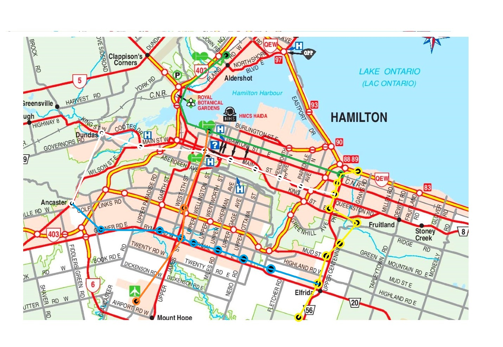

# Assignment 1 3020

A graph representing a subway system using an adjacency list done for the first assignment in Data structures and algorithms 2.
It is also implemented using a linked list instead of a primitive list to represent connections to other vertexes in the graph.
Testing done with MSTest framework.

